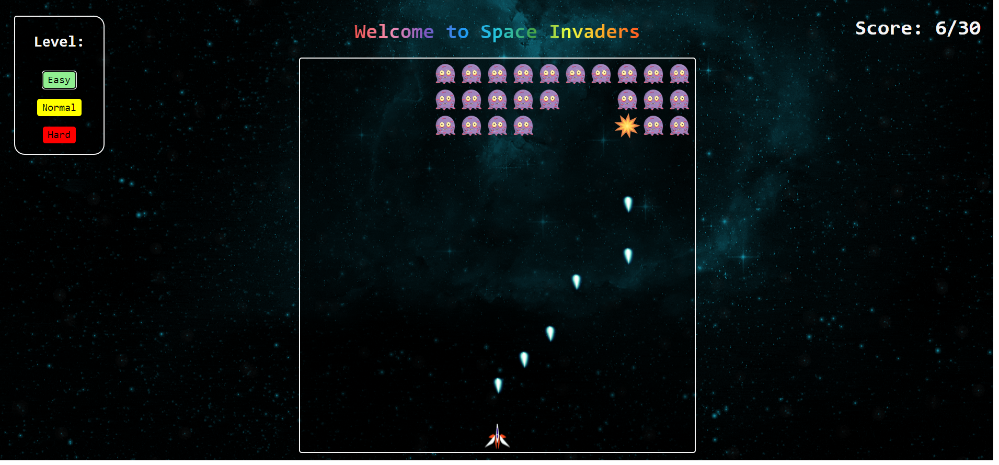

# space-invaders

<h3>Hello guys</h3>

This is a Space Invaders game with sound effects

I appreciate it if you contribute to this project and add other options and more themes or colors to this game. Thanx!

### * Languages and Tools:

  

  
 
  
  
  

### * Screenshot:

